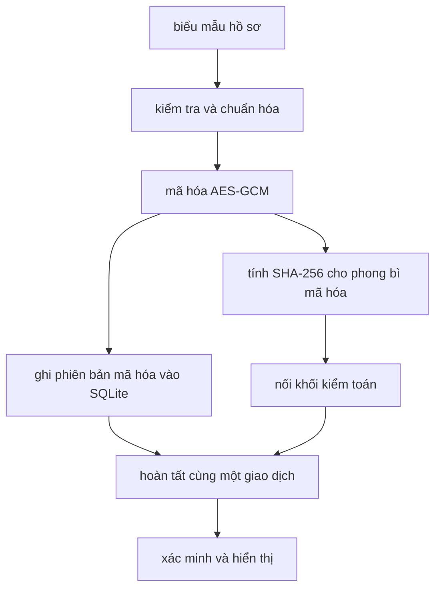

# hệ thống quản lý hồ sơ sinh viên có kiểm chứng

## giới thiệu

Đề tài xây dựng một ứng dụng quản lý hồ sơ sinh viên chạy trên một máy. Nội dung hồ sơ được mã hóa bằng AES-GCM trước khi lưu vào SQLite. Mỗi lần thêm, cập nhật hoặc xóa hồ sơ tạo một phiên bản mã hóa mới và một khối kiểm toán liên kết với khối trước bằng SHA-256.

Tên gọi chính xác của thành phần kiểm toán là **sổ nhật ký riêng tư liên kết băm**. Thành phần này giúp phát hiện thay đổi ngoài quy trình ứng dụng nhưng không phải là một mạng chuỗi khối phân tán.

## mục tiêu

1. Không lưu họ tên, mã sinh viên, ngày sinh, chương trình học và điểm ở dạng rõ trong SQLite.
2. Phát hiện bản mã, nonce, thẻ xác thực hoặc lịch sử khối bị thay đổi.
3. Giữ lại lịch sử thêm, cập nhật và xóa theo từng phiên bản.
4. Cung cấp giao diện quản lý và xác minh dễ dùng.
5. Tạo được dữ liệu, số liệu thô, thống kê và biểu đồ để viết báo cáo nghiên cứu.

## luồng xử lý thống nhất



SQLite chỉ nhận mã định danh nội bộ, chỉ mục HMAC, siêu dữ liệu mật mã và dữ liệu mã hóa. Mã sinh viên được dùng để tạo chỉ mục HMAC nhằm hỗ trợ tìm kiếm mà không phải lưu mã ở dạng rõ.

## chức năng hiện có

* thêm, xem, sửa và xóa logic hồ sơ sinh viên
* quản lý danh sách học phần và điểm
* lưu nhiều phiên bản mã hóa của một hồ sơ
* xem các khối kiểm toán đã lưu bền vững
* xác minh toàn hệ thống hoặc một hồ sơ
* sinh dữ liệu mô phỏng theo giá trị hạt giống
* so sánh ba cấu hình lưu trữ
* tổng hợp trung bình, trung vị, nhỏ nhất, lớn nhất và độ lệch chuẩn
* tạo biểu đồ phục vụ báo cáo

## cấu trúc mã nguồn

```text
secure_student_record_blockchain/
├── src/
│   ├── domain/          kiểm tra và chuẩn hóa hồ sơ
│   ├── encryption/      tuần tự hóa và AES-GCM
│   ├── integrity/       HMAC và SHA-256
│   ├── database/        lược đồ và truy cập SQLite
│   ├── blockchain/      cấu trúc khối và liên kết băm
│   ├── verification/    kết quả và quy trình xác minh
│   ├── services/        điều phối toàn bộ nghiệp vụ
│   └── web/             Flask, trang HTML, CSS và JavaScript
├── tests/               kiểm thử tự động
├── scripts/             tạo khóa, khởi tạo và dữ liệu minh họa
├── experiments/         sinh dữ liệu, đo và tạo biểu đồ
└── docs/                kế hoạch code và tài liệu báo cáo
```

Xem bảng giải thích chi tiết tại [kế hoạch code](docs/ke_hoach_code.md).

## yêu cầu môi trường

* Windows 10 hoặc Windows 11
* Python 3.11 trở lên
* Visual Studio Code
* Git

## cài đặt trên Windows

Mở thư mục dự án bằng Visual Studio Code, sau đó chạy trong cửa sổ lệnh PowerShell:

```powershell
py -3.11 -m venv .venv
.\.venv\Scripts\Activate.ps1
python -m pip install --upgrade pip
python -m pip install -r requirements-dev.txt
```

Nếu máy chỉ có một phiên bản Python, có thể thay `py -3.11` bằng `python`.

Để tái lập đúng môi trường đã được kiểm thử ngày 12/07/2026 bằng Python 3.12, dùng:

```powershell
python -m pip install -r requirements-lock.txt
```

## tạo khóa bí mật

```powershell
python scripts/generate_key.py
```

Lệnh trên tạo `.env` gồm khóa AES 256 bit và khóa phiên Flask. `.env` đã được loại khỏi Git.

Không dùng `--force` sau khi đã có dữ liệu cần giữ. Khóa mới sẽ khiến dữ liệu cũ không thể giải mã.

## khởi tạo cơ sở dữ liệu

```powershell
python scripts/init_db.py
```

Cơ sở dữ liệu mặc định được tạo tại `instance/student_records.db`.

## chạy ứng dụng

```powershell
python run.py
```

Mở địa chỉ `http://127.0.0.1:5000` trên trình duyệt.

Có thể thêm dữ liệu minh họa trước khi mở giao diện:

```powershell
python scripts/seed_demo.py
```

## chạy kiểm thử

```powershell
pytest -v
```

Đo độ bao phủ:

```powershell
pytest --cov=src --cov-report=term-missing
```

## sinh dữ liệu thực nghiệm

```powershell
python experiments/generate_dataset.py --size 100
python experiments/generate_dataset.py --size 1000
python experiments/generate_dataset.py --size 10000
```

Các tệp được tạo trong `experiments/datasets`. Dữ liệu là mô phỏng, không lấy từ sinh viên thật.

## chạy thực nghiệm

Chạy thử nhanh trước:

```powershell
python experiments/run_experiment.py --sizes 100 --repeats 1
```

Chạy bộ đo dùng cho báo cáo:

```powershell
python experiments/run_experiment.py --sizes 100 1000 10000 --repeats 30
```

Ba cấu hình được đo trên cùng dữ liệu và cùng máy:

1. chỉ SQLite
2. SQLite và AES-GCM
3. SQLite, AES-GCM và sổ nhật ký liên kết băm

Ba cấu hình đều ghi mỗi hồ sơ bằng một giao dịch SQLite và cùng dùng chế độ WAL. Thứ tự chạy được xáo trộn theo cách có thể tái lập ở mỗi lần lặp để giảm sai lệch do cấu hình luôn chạy trước hoặc sau.

Chỉ số xác minh có ý nghĩa khác nhau theo lớp bảo vệ. Cấu hình chỉ SQLite kiểm tra khả năng đọc và cấu trúc JSON. Cấu hình AES-GCM xác thực từng bản mã. Cấu hình đầy đủ kiểm tra cả chuỗi khối, giá trị băm và AES-GCM. Vì vậy cần trình bày đây là chi phí của chức năng mà từng cấu hình cung cấp, không coi ba phép kiểm tra là tương đương.

Tệp `raw_*.csv` giữ từng lần đo và vị trí thứ tự chạy. Tệp `summary_*.csv` giữ thống kê tổng hợp. Không chỉnh sửa số liệu thô bằng tay.

## tạo biểu đồ

```powershell
python experiments/make_figures.py
```

Biểu đồ được lưu trong `docs/figures`.

## thử thay đổi trái phép

Chương trình luôn tạo cơ sở dữ liệu tạm, không sửa cơ sở dữ liệu đang dùng:

```powershell
python experiments/tamper_test.py --trials 30
```

Các trường hợp gồm sửa bản mã, sửa thẻ xác thực, sửa nonce, sửa giá trị băm, sửa liên kết khối và xóa một khối ở giữa. Kết quả thô và tỷ lệ phát hiện được lưu trong `experiments/results`.

## nguyên tắc sử dụng an toàn

1. Không đưa `.env`, tệp cơ sở dữ liệu hoặc dữ liệu sinh viên thật lên GitHub.
2. Không ghi khóa vào mã nguồn, ảnh chụp màn hình hoặc tệp nhật ký.
3. Không tái sử dụng nonce với cùng khóa AES-GCM.
4. Không thay khóa khi chưa có quy trình chuyển đổi dữ liệu.
5. Sao lưu khóa và cơ sở dữ liệu ở hai vị trí được kiểm soát.
6. Chỉ dùng dữ liệu mô phỏng trong quá trình nghiên cứu nếu chưa có phê duyệt xử lý dữ liệu thật.

## giới hạn nghiên cứu

Hệ thống hiện chạy trên một nút. Người có toàn quyền sửa cơ sở dữ liệu và có khóa có thể tính lại lịch sử. Việc khôi phục toàn bộ cơ sở dữ liệu về một bản cũ cũng không thể được phát hiện nếu không có giá trị đầu chuỗi được giữ ở nơi độc lập.

Xóa hồ sơ hiện là xóa logic. Các phiên bản cũ vẫn được giữ ở dạng mã hóa để phục vụ kiểm toán. Cách làm này cần được đánh giá thêm nếu áp dụng quy định bắt buộc xóa dữ liệu cá nhân.

Chữ ký số, phân quyền chi tiết, quản lý khóa tập trung, nhiều nút và neo giá trị đầu chuỗi ra vị trí độc lập là các hướng phát triển tiếp theo.

## trạng thái tài liệu báo cáo

Mã nguồn và kế hoạch thực nghiệm có thể được hoàn thiện độc lập. Bản báo cáo theo đúng mẫu FAIR 2026 cần tệp mẫu và tài liệu tham khảo gốc để kiểm tra bố cục, tác giả, trích dẫn, hình và bảng. Không điền kết quả định lượng trước khi chạy đủ thực nghiệm.
