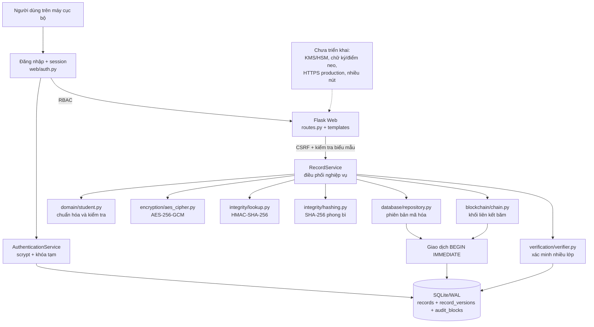

# Secure Student Record Blockchain

Hệ thống quản lý hồ sơ sinh viên có mã hóa và kiểm chứng toàn vẹn, xây dựng bằng Python, Flask và SQLite.

> **Trạng thái:** proof-of-concept phục vụ học tập và thực nghiệm. Phần lõi mã hóa, phiên bản hóa, đăng nhập/RBAC, truy vết người thao tác, sổ kiểm toán liên kết băm, xác minh và giao diện quản lý đã hoạt động. Hệ thống **không phải mạng blockchain phân tán** và chưa có KMS/HSM hoặc điểm neo độc lập, vì vậy chưa phù hợp để triển khai với dữ liệu sinh viên thật.

## Tổng quan

Mỗi thao tác tạo, cập nhật hoặc xóa logic một hồ sơ sẽ:

1. kiểm tra và chuẩn hóa dữ liệu;
2. tạo phiên bản hồ sơ mới;
3. mã hóa JSON bằng AES-256-GCM với nonce 12 byte mới;
4. gắn `actor_id`/vai trò vào AAD và tính SHA-256 cho phong bì mã hóa;
5. nối một khối kiểm toán với khối trước;
6. ghi phiên bản, khối và con trỏ phiên bản trong **cùng một giao dịch SQLite**.

Mã sinh viên không được lưu ở dạng rõ. Hệ thống dẫn xuất một khóa tra cứu riêng và lưu HMAC-SHA-256 để hỗ trợ tìm kiếm chính xác.

## Trạng thái rà soát

| Hạng mục | Kết quả ngày 20/07/2026 |
|---|---|
| Kiểm thử tự động | 79/79 đạt |
| Độ bao phủ mã nguồn | 88% |
| Kiểm tra cú pháp Python | Đạt |
| Cài đặt từ `requirements-lock.txt` | Đạt trên Python 3.12 |
| Thử nhanh sau nâng cấp, 6 kiểu can thiệp | Phát hiện 6/6 lần |
| Thực nghiệm nhanh 3 cấu hình, 100 hồ sơ | Xuất đủ CSV và metadata |
| Đăng nhập, khóa tạm và RBAC | Đã triển khai |
| `actor_id` trong AAD, phiên bản và block | Đã triển khai; tương thích schema v1 |
| Blockchain nhiều nút / neo hash độc lập | Chưa triển khai |

Kết luận: đề tài **đã đạt mức proof-of-concept nghiên cứu có kiểm soát truy cập**, nhưng vẫn cần quản lý khóa, HTTPS, vận hành an toàn và một điểm neo độc lập trước khi có thể xem là hệ thống thực tế. Xem báo cáo rà soát chi tiết tại [`docs/RA_SOAT_VA_CHINH_SUA.md`](docs/RA_SOAT_VA_CHINH_SUA.md).

## Kiến trúc hiện thực

Sơ đồ dưới đây mô tả đúng mã nguồn hiện tại, không bao gồm các hạng mục mới chỉ có trong kiến trúc đề xuất.



Tài liệu kiến trúc đầy đủ gồm luồng ghi, luồng xác minh và lược đồ dữ liệu: [`docs/KIEN_TRUC_HE_THONG.md`](docs/KIEN_TRUC_HE_THONG.md).

## Các lớp bảo vệ

| Mục tiêu | Cơ chế hiện có | Phạm vi |
|---|---|---|
| Bảo mật nội dung | AES-256-GCM | Họ tên, mã sinh viên, ngày sinh, chương trình và điểm chỉ xuất hiện trong ciphertext |
| Tìm kiếm kín | HMAC-SHA-256 với khóa dẫn xuất | Tra mã sinh viên mà không lưu mã rõ |
| Xác thực ngữ cảnh | AAD gồm `record_id`, `version`, `operation`, `schema_version` | Ngăn tráo bản mã giữa hồ sơ hoặc phiên bản |
| Toàn vẹn phong bì | SHA-256 có phân tách miền | Phát hiện thay đổi nonce, ciphertext hoặc metadata |
| Toàn vẹn lịch sử | `previous_hash` và `block_hash` | Phát hiện sửa, chèn, xóa hoặc đổi thứ tự khối |
| Nhất quán dữ liệu | `BEGIN IMMEDIATE`, COMMIT/ROLLBACK | Phiên bản và khối được ghi nguyên tử |
| An toàn biểu mẫu | CSRF token, giới hạn nội dung, security headers | Giảm rủi ro trên giao diện web cục bộ |
| Chống ghi đè | `expected_version` | Phát hiện cập nhật trên phiên bản đã cũ |
| Xác thực | Password hash `scrypt`, session ký, khóa tạm | Không lưu mật khẩu rõ; khóa sau nhiều lần đăng nhập sai |
| Phân quyền | `admin`, `registrar`, `auditor` | Chỉ admin/cán bộ học vụ được thay đổi hồ sơ |
| Truy vết chủ thể | `actor_id` và role trong AAD, version, block hash | Phát hiện thay đổi hoặc tráo danh tính người thao tác |

Lưu ý: `cryptography.hazmat.primitives.ciphers.aead.AESGCM` trả về ciphertext đã nối thẻ xác thực 16 byte; cơ sở dữ liệu không có cột `tag` riêng.

## Chức năng

- Thêm, xem, sửa và xóa logic hồ sơ sinh viên.
- Quản lý học phần, điểm và GPA.
- Lưu toàn bộ lịch sử phiên bản đã mã hóa.
- Xem các khối kiểm toán sau khi khởi động lại ứng dụng.
- Xác minh toàn hệ thống hoặc một hồ sơ cụ thể.
- Sinh dữ liệu mô phỏng 100, 1.000 và 10.000 hồ sơ.
- So sánh ba cấu hình: SQLite; SQLite + AES-GCM; SQLite + AES-GCM + sổ kiểm toán.
- Xuất dữ liệu thô, thống kê, metadata môi trường và biểu đồ.
- Thử thay đổi trái phép trên cơ sở dữ liệu tạm.

## Yêu cầu

- Windows 10/11.
- Python 3.11 trở lên; môi trường khóa phiên bản đã được kiểm tra với Python 3.12.
- Git và PowerShell.

## Cài đặt nhanh

```powershell
git clone https://github.com/hv6z/secure_student_record_blockchain.git
cd secure_student_record_blockchain

py -3.12 -m venv .venv
.\.venv\Scripts\Activate.ps1
python -m pip install --upgrade pip
python -m pip install -r requirements-lock.txt
```

Nếu không cần tái lập đúng phiên bản thư viện đã đo, có thể dùng:

```powershell
python -m pip install -r requirements-dev.txt
```

## Cấu hình và khởi chạy

Tạo khóa AES 256 bit và khóa phiên Flask:

```powershell
python scripts/generate_key.py
```

Lệnh tạo tệp `.env` cục bộ. Tệp này đã nằm trong `.gitignore`.

> Không dùng `--force` khi đã có dữ liệu cần giữ. Thay AES key sẽ làm các phiên bản cũ không thể giải mã.

Khởi tạo cơ sở dữ liệu, thêm dữ liệu minh họa và chạy ứng dụng:

```powershell
python scripts/init_db.py
python scripts/manage_user.py create --username admin --role admin
python scripts/seed_demo.py
python run.py
```

Mở [http://127.0.0.1:5000](http://127.0.0.1:5000).

Mật khẩu được nhập ẩn hai lần và không xuất hiện trong lịch sử lệnh. Quản lý thêm tài khoản bằng:

```powershell
python scripts/manage_user.py list
python scripts/manage_user.py create --username hocvu --role registrar
python scripts/manage_user.py create --username kiemtoan --role auditor
python scripts/manage_user.py password hocvu
python scripts/manage_user.py disable hocvu
```

### Biến môi trường

| Biến | Bắt buộc | Mặc định | Ý nghĩa |
|---|---:|---|---|
| `AES_KEY` | Có | Không có | Khóa AES 32 byte, mã hóa Base64 |
| `FLASK_SECRET_KEY` | Có | Không có | Ký phiên và CSRF token |
| `DATABASE_PATH` | Không | `instance/student_records.db` | Đường dẫn SQLite |
| `KEY_ID` | Không | `key-v1` | Nhãn nhận dạng khóa, không phải khóa bí mật |
| `SESSION_LIFETIME_MINUTES` | Không | `30` | Thời gian tồn tại của phiên đăng nhập |
| `LOGIN_MAX_ATTEMPTS` | Không | `5` | Số lần sai trước khi khóa tạm |
| `LOGIN_LOCKOUT_MINUTES` | Không | `15` | Thời gian khóa tài khoản |
| `SESSION_COOKIE_SECURE` | Không | `false` | Đặt `true` khi chạy sau HTTPS |

## Kiểm thử

```powershell
pytest -v
pytest --cov=src --cov-report=term-missing
```

Nếu Windows không cho pytest dùng thư mục tạm mặc định:

```powershell
pytest --basetemp=.pytest-tmp
```

## Thực nghiệm

Sinh dữ liệu mô phỏng:

```powershell
python experiments/generate_dataset.py --size 100
python experiments/generate_dataset.py --size 1000
python experiments/generate_dataset.py --size 10000
```

Chạy thử nhanh trước khi đo chính thức:

```powershell
python experiments/run_experiment.py --sizes 100 --repeats 1
```

Chạy cấu hình dùng cho báo cáo:

```powershell
python experiments/run_experiment.py --sizes 100 1000 10000 --repeats 30
python experiments/make_figures.py
```

Mỗi cấu hình ghi một hồ sơ bằng một giao dịch SQLite và dùng WAL. Thứ tự cấu hình được xáo trộn có thể tái lập theo từng lần lặp. Ba phép `verify` không tương đương về chức năng: SQLite chỉ kiểm tra khả năng đọc/JSON, AES xác thực từng bản mã, còn cấu hình đầy đủ kiểm tra cả AES và chuỗi liên kết băm.

Các tệp `raw_*.csv`, `summary_*.csv` và `metadata_*.json` được lưu trong `experiments/results`. Không chỉnh số liệu thô bằng tay.

Thử can thiệp trên cơ sở dữ liệu tạm:

```powershell
python experiments/tamper_test.py --trials 30
```

Các trường hợp gồm thay đổi ciphertext, thẻ xác thực, nonce, băm phong bì, liên kết khối và xóa khối giữa.

## Cấu trúc dự án

```text
secure_student_record_blockchain/
├── src/
│   ├── domain/          chuẩn hóa và kiểm tra hồ sơ
│   ├── auth/            tài khoản, password hashing và khóa đăng nhập
│   ├── encryption/      JSON chuẩn và AES-GCM
│   ├── integrity/       HMAC tra cứu và SHA-256
│   ├── database/        kết nối, schema và repository
│   ├── blockchain/      cấu trúc khối và chuỗi liên kết băm
│   ├── verification/    xác minh chuỗi, phong bì và AES-GCM
│   ├── services/        điều phối nghiệp vụ trong transaction
│   └── web/             ứng dụng Flask và giao diện
├── tests/               kiểm thử tự động
├── scripts/             tạo khóa, khởi tạo DB và dữ liệu demo
├── experiments/         dữ liệu, đo lường, tamper test và biểu đồ
└── docs/                kiến trúc, rà soát và nội dung báo cáo
```

## Mô hình tin cậy và giới hạn

- Đây là **sổ nhật ký kiểm toán liên kết băm một nút**, không phải blockchain permissioned nhiều nút.
- Người có quyền sửa toàn bộ SQLite và biết khóa có thể tính lại lịch sử.
- Khôi phục đồng thời database và khóa về một bản cũ không thể bị phát hiện nếu không neo đầu chuỗi ra vị trí độc lập.
- Đăng nhập/RBAC giảm truy cập trái phép ở tầng ứng dụng nhưng không bảo vệ khi máy chủ, database và khóa đều bị chiếm quyền.
- Xóa là xóa logic; các phiên bản cũ vẫn tồn tại ở dạng mã hóa để bảo toàn lịch sử kiểm toán.
- Chưa có KMS/HSM, xoay khóa, sao lưu khóa có kiểm soát, chữ ký số hoặc kiểm toán danh tính người thao tác.
- Chỉ nên dùng dữ liệu mô phỏng cho đến khi có cơ chế truy cập phù hợp và phê duyệt xử lý dữ liệu cá nhân.

## Tài liệu

- [Kiến trúc hệ thống và các sơ đồ](docs/KIEN_TRUC_HE_THONG.md)
- [Kế hoạch code và luồng nghiệp vụ](docs/ke_hoach_code.md)
- [Kết quả rà soát và việc còn lại](docs/RA_SOAT_VA_CHINH_SUA.md)
- [Bản nháp nội dung báo cáo](docs/report/du_thao_noi_dung.md)

## Hướng phát triển ưu tiên

1. Bổ sung KMS/HSM, phiên bản khóa và quy trình xoay/chuyển đổi dữ liệu.
2. Ký số hoặc neo định kỳ `block_hash` cuối vào kho độc lập.
3. Bổ sung CI, dependency audit, backup/restore test và triển khai HTTPS.
4. Thêm giao diện quản trị tài khoản có bước xác nhận lại mật khẩu và nhật ký sự kiện đăng nhập.
5. Nếu cần tính bất biến mạnh, chuyển sổ kiểm toán sang mạng permissioned nhiều tổ chức.
