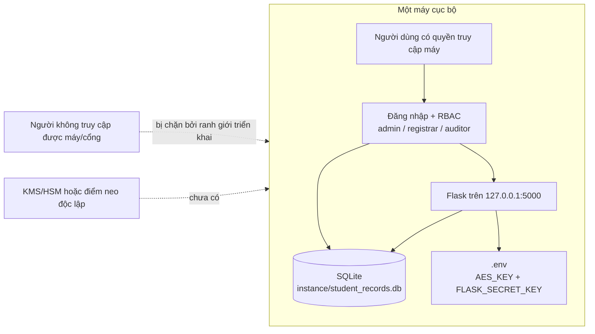
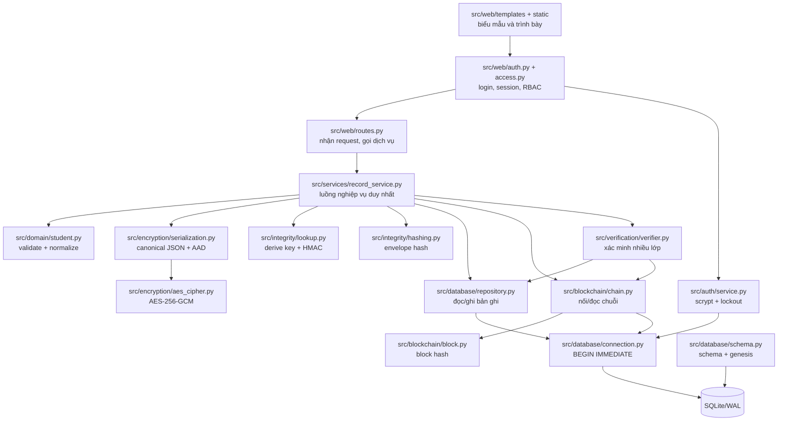
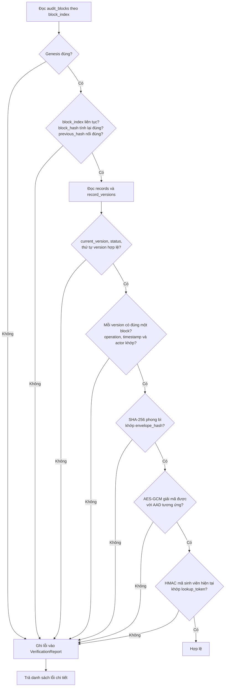
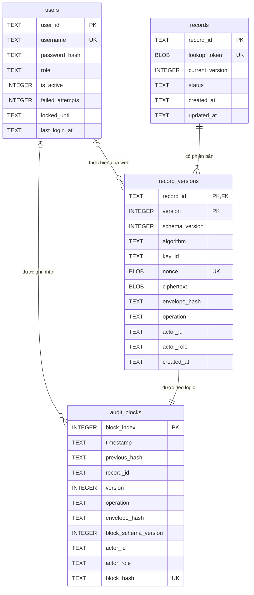
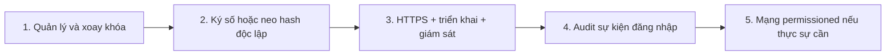

# Kiến trúc hệ thống hiện thực

Tài liệu này mô tả kiến trúc **as-built** của mã nguồn ngày 20/07/2026. Các thành phần chưa có trong source được tách riêng ở cuối tài liệu để tránh nhầm lẫn giữa hệ thống hiện tại và kiến trúc nâng cấp.

## 1. Phạm vi tin cậy



Ứng dụng xác thực bằng password hash `scrypt`, khóa tài khoản tạm thời, phiên ký, CSRF token và RBAC. Ranh giới triển khai vẫn phụ thuộc vào quyền truy cập máy, bảo vệ `.env` và việc chỉ lắng nghe trên `127.0.0.1`.

## 2. Sơ đồ thành phần



`routes.py` không tự mã hóa, tính băm hoặc chạy SQL. `RecordService` là điểm điều phối duy nhất để phiên bản mã hóa và khối kiểm toán luôn đi qua cùng một transaction.

## 3. Luồng tạo/cập nhật/xóa

```mermaid
sequenceDiagram
    autonumber
    actor User as Người dùng cục bộ
    participant Auth as Login + RBAC
    participant Web as Flask routes
    participant Service as RecordService
    participant Domain as student.py
    participant Crypto as AES-GCM + HMAC + SHA-256
    participant DB as SQLite transaction
    participant Chain as Hash-chained ledger

    User->>Auth: Đăng nhập
    Auth-->>User: Session đã ký + role
    User->>Web: Gửi biểu mẫu + CSRF token
    Web->>Auth: Kiểm tra session và quyền ghi
    Auth-->>Web: actor_id + actor_role
    Web->>Service: create/update/delete
    Service->>Domain: Kiểm tra và chuẩn hóa
    Domain-->>Service: JSON chuẩn hóa
    Service->>Crypto: Tạo lookup token; mã hóa với AAD + actor
    Crypto-->>Service: nonce + ciphertext/tag + envelope_hash
    Service->>DB: BEGIN IMMEDIATE
    Service->>DB: Ghi record hoặc record_versions
    Service->>Chain: Tạo khối từ khối cuối
    Chain->>DB: Ghi audit_blocks
    Service->>DB: Cập nhật current_version/status
    alt Mọi bước thành công
        Service->>DB: COMMIT
        Service-->>Web: Hồ sơ và metadata
    else Có lỗi hoặc xung đột
        Service->>DB: ROLLBACK
        Service-->>Web: Lỗi có kiểm soát
    end
```

### Dữ liệu xác thực bổ sung

AAD được tạo từ:

```text
record_id + version + operation + schema_version + actor_id + actor_role
```

Do đó, bản mã hợp lệ không thể bị chuyển sang hồ sơ, phiên bản, loại thao tác hoặc danh tính người thao tác khác mà vẫn giải mã thành công. Dữ liệu schema v1 cũ không có actor vẫn được đọc bằng nhánh tương thích.

### Cách lưu thẻ GCM

Thư viện `AESGCM.encrypt()` trả về:

```text
ciphertext || authentication_tag_16_bytes
```

Hai phần được lưu chung trong cột `record_versions.ciphertext`. Đây là lý do schema không có cột `auth_tag` riêng.

## 4. Luồng xác minh



`VerificationReport.valid` chỉ bằng `True` khi không có thông báo lỗi. Việc xác minh toàn hệ thống kiểm tra cả các phiên bản hoặc khối mồ côi.

## 5. Lược đồ SQLite



Quan hệ `record_versions` - `audit_blocks` được xác minh ở tầng ứng dụng theo cặp `(record_id, version)`; schema hiện không khai báo foreign key cho `audit_blocks` để vẫn có thể phát hiện và báo cáo các trạng thái mồ côi do can thiệp trái phép.

## 6. Nội dung được và không được lưu rõ

| Nhóm | Nội dung trong SQLite |
|---|---|
| Định danh nội bộ | UUID `record_id` |
| Tra cứu | HMAC `lookup_token` |
| Mật mã | `algorithm`, `key_id`, nonce, ciphertext kèm tag |
| Phiên bản | version, operation, timestamp, status |
| Kiểm toán | envelope hash, previous hash, block hash |
| Tài khoản | username, password hash `scrypt`, role, trạng thái khóa; không lưu mật khẩu rõ |
| Chủ thể thao tác | `actor_id` và role trong phiên bản mã hóa lẫn block |
| Dữ liệu nghiệp vụ | Không lưu rõ; nằm trong JSON đã mã hóa |

Khóa AES và khóa phiên Flask nằm trong `.env`, không nằm trong SQLite hoặc Git.

## 7. So sánh với kiến trúc đề xuất

| Thành phần | Trạng thái | Ghi chú |
|---|---|---|
| Validate/normalize | Đã có | `src/domain/student.py` |
| AES-256-GCM, nonce mới, AAD | Đã có | `src/encryption/` |
| HMAC tra cứu và SHA-256 phong bì | Đã có | `src/integrity/` |
| Phiên bản hóa và xóa logic | Đã có | `RecordService` + SQLite |
| Transaction nguyên tử | Đã có | `BEGIN IMMEDIATE` + rollback |
| Sổ kiểm toán liên kết băm | Đã có | Một chuỗi toàn cục, một nút |
| Xác minh nhiều lớp | Đã có | Chuỗi, phiên bản, hash, AES-GCM, HMAC |
| CSRF và HTTP security headers | Đã có | Kèm `Cache-Control: no-store` cho trang đã đăng nhập |
| Đăng nhập và password hashing | Đã có | `scrypt`, khóa tạm và phiên hết hạn |
| RBAC | Đã có | `admin`, `registrar`, `auditor` |
| `actor_id` trong AAD/block | Đã có | Schema v2; đọc/xác minh được schema v1 |
| KMS/HSM và xoay khóa | Chưa có | `.env` chỉ phù hợp proof-of-concept |
| Chữ ký số / neo hash độc lập | Chưa có | Cần để tăng khả năng chống viết lại lịch sử |
| Blockchain permissioned nhiều nút | Chưa có | Không nên tuyên bố tính bất biến phân tán |

## 8. Thứ tự nâng cấp đề xuất



Các bước 1-4 cần hoàn thành trước khi cân nhắc dữ liệu thật. Bước 5 là quyết định kiến trúc riêng, không phải điều kiện bắt buộc cho mục tiêu proof-of-concept hiện tại.
