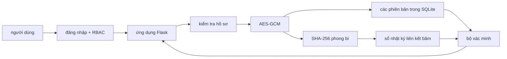

# dự thảo nội dung báo cáo

## trạng thái tài liệu

Tệp này đã được đối chiếu với mã nguồn, 79 kiểm thử tự động và bộ kết quả thực nghiệm ngày 12/07/2026. Các trường tác giả, đơn vị công tác và thông số phần cứng của máy đã chạy phép đo vẫn phải được người thực hiện xác nhận trước khi đưa vào mẫu FAIR 2026.

Bộ số liệu 30 lần lặp được tạo trước đợt bổ sung đăng nhập/RBAC và actor schema v2 ngày 20/07/2026. Chức năng mới đã qua kiểm thử và chạy benchmark nhanh, nhưng phải chạy lại bộ 30 lần lặp trước khi dùng số hiệu năng như kết quả cuối của phiên bản hiện tại.

Không đưa tệp này vào mẫu FAIR 2026 trước khi nhận lại mẫu báo cáo và kiểm tra quy định định dạng.

## tiêu đề đề xuất

Quản lý hồ sơ sinh viên có kiểm chứng bằng mã hóa xác thực và sổ nhật ký liên kết băm

## tóm tắt

Nghiên cứu xây dựng hệ thống quản lý hồ sơ sinh viên một nút, trong đó nội dung hồ sơ được mã hóa bằng AES-GCM 256 bit trước khi lưu trong SQLite; mỗi phiên bản được băm SHA-256 và nối vào sổ nhật ký liên kết băm. Hệ thống được đánh giá trên các bộ dữ liệu mô phỏng gồm 100, 1.000 và 10.000 hồ sơ, với 30 lần lặp cho ba cấu hình lưu trữ. Ở cấu hình đầy đủ, thời gian thêm trung bình trên một hồ sơ lần lượt là 9,897 ms, 10,629 ms và 8,225 ms; thời gian xác minh toàn bộ lần lượt là 21,794 ms, 173,930 ms và 1.513,813 ms. Sáu kiểu sửa đổi trái phép đều được phát hiện 30/30 lần trong phạm vi thử nghiệm. Kết quả chứng minh tính khả thi về chức năng và khả năng phát hiện sửa đổi trong mô hình đe dọa đã nêu, nhưng không chứng minh tính bất biến trước người kiểm soát đồng thời cơ sở dữ liệu và khóa, cũng không đại diện cho blockchain phân tán nhiều nút.

## từ khóa

hồ sơ sinh viên, AES-GCM, tính toàn vẹn dữ liệu, kiểm toán, chuỗi liên kết băm

## I. mở đầu

Hồ sơ sinh viên chứa thông tin định danh, chương trình học và kết quả học tập. Việc chỉ giới hạn quyền truy cập cơ sở dữ liệu chưa đủ để phát hiện dữ liệu đã bị thay đổi ngoài quy trình của ứng dụng. Đề tài này khảo sát cách kết hợp mã hóa xác thực với một sổ nhật ký liên kết băm nhằm bảo vệ nội dung lưu trữ và tạo dấu vết kiểm toán cho từng phiên bản hồ sơ.

Hệ thống đề xuất chuẩn hóa hồ sơ thành JSON, mã hóa nội dung bằng AES-GCM với khóa 256 bit, lưu bản mã trong SQLite và tính SHA-256 trên toàn bộ phong bì mã hóa. Mỗi thao tác thêm, cập nhật hoặc xóa logic tạo một khối kiểm toán chứa giá trị băm của phiên bản và giá trị băm của khối trước.

Các đóng góp dự kiến gồm:

1. một luồng lưu trữ nguyên tử nối mã hóa, phiên bản dữ liệu và kiểm toán
2. cơ chế tìm mã sinh viên bằng HMAC mà không lưu mã ở dạng rõ
3. quy trình xác minh ba lớp cho liên kết khối, phong bì mã hóa và thẻ AES-GCM
4. bộ thực nghiệm có thể tái lập để đo chi phí của từng lớp bảo vệ
5. cơ chế đăng nhập/RBAC và gắn danh tính người thao tác vào AAD lẫn khối kiểm toán

Các phát biểu trên cần được nối với tài liệu tham khảo phù hợp sau khi nhận lại danh mục nguồn gốc.

## II. nghiên cứu liên quan

Chia nội dung thành ba nhóm:

1. quản lý và bảo vệ hồ sơ giáo dục
2. mã hóa xác thực cho dữ liệu lưu trữ
3. chuỗi khối hoặc nhật ký chống sửa đổi trong giáo dục

### bảng so sánh cần hoàn thiện

| nghiên cứu | dữ liệu được mã hóa | cơ chế toàn vẹn | lưu lịch sử | thực nghiệm hiệu năng | giới hạn |
|---|---:|---:|---:|---:|---|
| nguồn 1 | chờ đối chiếu | chờ đối chiếu | chờ đối chiếu | chờ đối chiếu | chờ đối chiếu |
| nguồn 2 | chờ đối chiếu | chờ đối chiếu | chờ đối chiếu | chờ đối chiếu | chờ đối chiếu |

Không điền tên bài, năm hoặc kết luận từ trí nhớ. Mọi hàng phải được kiểm tra từ tài liệu gốc.

## III. hệ thống đề xuất

### kiến trúc



Hệ thống chạy trên một máy và có một đầu ghi. Vì vậy, thành phần kiểm toán được mô tả là sổ nhật ký riêng tư liên kết băm, không được coi là một mạng chuỗi khối phân tán có đồng thuận nhiều nút.

### dữ liệu lưu trữ

Bốn bảng chính là:

* `users` lưu username, password hash `scrypt`, vai trò và trạng thái đăng nhập/khóa
* `records` lưu UUID nội bộ, chỉ mục HMAC, phiên bản hiện tại, trạng thái và thời gian
* `record_versions` lưu thuật toán, mã khóa, nonce, bản mã có thẻ xác thực, giá trị băm, thao tác và actor
* `audit_blocks` lưu chiều cao, thời gian, liên kết khối, UUID, phiên bản, thao tác, actor và các giá trị băm

Họ tên, mã sinh viên, ngày sinh, chương trình, học phần và điểm không được lưu dạng rõ.

### mô hình đe dọa

Đề tài xét kẻ sửa đổi có thể đọc và thay đổi tệp SQLite nhưng không biết khóa AES. Các hành vi thử nghiệm gồm sửa bản mã, sửa thẻ xác thực, sửa nonce, sửa giá trị băm, sửa liên kết và xóa một khối. Ở tầng ứng dụng, đăng nhập, khóa tạm và RBAC giới hạn thao tác theo vai trò; các tấn công xác thực nâng cao chưa nằm trong bộ thực nghiệm định lượng.

Mô hình không bao phủ kẻ có đồng thời toàn quyền cơ sở dữ liệu và khóa bí mật. Mô hình cũng không tự phát hiện việc thay cả tệp cơ sở dữ liệu bằng một bản sao cũ nếu không có đầu chuỗi tin cậy được giữ ở nơi khác.

### giao dịch nguyên tử

Khi tạo một phiên bản, hệ thống dùng `BEGIN IMMEDIATE` trước khi ghi. Việc ghi phiên bản, cập nhật con trỏ hồ sơ và nối khối nằm trong cùng một giao dịch. Nếu bất kỳ bước nào thất bại, SQLite hoàn tác toàn bộ thay đổi.

## IV. mô hình mật mã

### chuẩn hóa hồ sơ

Gọi hồ sơ chuẩn hóa là `R`. Dữ liệu rõ đưa vào mã hóa là:

```text
P = JSON_chuẩn(R)
```

JSON sử dụng UTF-8, sắp xếp khóa, không có khoảng trắng không cần thiết và từ chối giá trị không hữu hạn.

### mã hóa xác thực

Với mỗi phiên bản, hệ thống tạo nonce ngẫu nhiên 12 byte mới. Dữ liệu xác thực bổ sung liên kết bản mã với ngữ cảnh:

```text
A = JSON_chuẩn(record_id, version, operation, schema_version, actor_id, actor_role)
C = AES-GCM-Encrypt(K, nonce, P, A)
```

`C` gồm bản mã và thẻ xác thực 16 byte do thư viện `cryptography` trả về. Khóa `K` dài 32 byte và được đọc từ `.env`.

### giá trị băm phiên bản

Phong bì được băm gồm UUID, phiên bản, thao tác, actor, phiên bản cấu trúc, tên thuật toán, mã khóa, nonce và bản mã:

```text
H_record = SHA-256(domain_record || JSON_chuẩn(phong_bì))
```

Tiền tố miền tách mục đích băm phong bì khỏi mục đích băm khối.

### giá trị băm khối

Khối thứ `i` chứa chiều cao, thời gian, UUID, phiên bản, thao tác, actor, `H_record` và giá trị băm của khối trước:

```text
H_i = SHA-256(domain_block || JSON_chuẩn(block_i))
```

Khối đầu tiên có thời gian và dữ liệu cố định. Các khối sau phải có `previous_hash = H_(i-1)`.

### chỉ mục tìm kiếm

Khóa HMAC được dẫn xuất từ khóa AES bằng HKDF-SHA256 với chuỗi phân tách miền. Mã sinh viên chuẩn hóa được ánh xạ thành:

```text
lookup_token = HMAC-SHA-256(K_lookup, domain_lookup || student_code)
```

Cách này che mã sinh viên khỏi người chỉ đọc SQLite. Nó vẫn làm lộ việc hai giá trị tra cứu giống nhau và chưa hỗ trợ luân chuyển khóa độc lập trong phiên bản hiện tại.

## V. cài đặt

Ứng dụng dùng Python, Flask, SQLite và thư viện `cryptography`. Lớp `RecordService` là điểm điều phối duy nhất cho các thao tác hồ sơ. Giao diện không chứa câu lệnh SQLite hoặc thuật toán mật mã.

| nhóm mã | trách nhiệm |
|---|---|
| `src/domain` | chuẩn hóa và kiểm tra hồ sơ |
| `src/encryption` | JSON xác định, AAD và AES-GCM |
| `src/integrity` | HKDF, HMAC và SHA-256 |
| `src/database` | lược đồ, kết nối và truy cập dữ liệu |
| `src/blockchain` | cấu trúc và phép băm khối |
| `src/verification` | xác minh ba lớp |
| `src/services` | giao dịch nghiệp vụ thống nhất |
| `src/web` | giao diện quản lý và xác minh |

Phần này cần bổ sung ảnh thật của bảng điều khiển, danh sách hồ sơ, chi tiết hồ sơ, chuỗi khối và kết quả phát hiện thay đổi.

## VI. thiết lập thực nghiệm

### môi trường

| thuộc tính | giá trị |
|---|---|
| bộ xử lý | cần xác nhận từ máy đã chạy bộ số liệu ngày 12/07/2026 |
| bộ nhớ | cần xác nhận từ máy đã chạy bộ số liệu ngày 12/07/2026 |
| hệ điều hành | cần xác nhận từ máy đã chạy bộ số liệu ngày 12/07/2026 |
| Python | 3.12 theo `requirements-lock.txt`; cần đối chiếu phiên bản vá |
| Flask | 3.1.3 theo `requirements-lock.txt` |
| cryptography | 49.0.0 theo `requirements-lock.txt` |
| SQLite | cần ghi từ `sqlite3.sqlite_version` trên máy đo |

Các lần chạy mới tự động tạo tệp `metadata_*.json` hoặc `tamper_metadata_*.json` để tránh thiếu thông tin môi trường như bộ kết quả cũ.

### dữ liệu và cấu hình

Dữ liệu mô phỏng gồm 100, 1.000 và 10.000 hồ sơ, sinh bằng cùng giá trị hạt giống. Mỗi quy mô được chạy 30 lần trên ba cấu hình:

1. chỉ SQLite
2. SQLite và AES-GCM
3. SQLite, AES-GCM và sổ nhật ký liên kết băm

Các chỉ số gồm thời gian thêm, thời gian đọc, thời gian xác minh, thời gian mã hóa, thời gian giải mã và dung lượng SQLite. Tệp thô được giữ nguyên trước khi tính trung bình, trung vị, nhỏ nhất, lớn nhất và độ lệch chuẩn.

Thử thay đổi trái phép chạy trên bản sao tạm của cơ sở dữ liệu. Mỗi trường hợp phải được lặp lại và báo cả số lần phát hiện lẫn tổng số lần thử.

## VII. kết quả và thảo luận

Các bảng dưới đây lấy từ `summary_20260712T125205Z.csv` và `tamper_summary_20260712T125526Z.csv`. Mỗi giá trị thời gian là trung bình của 30 lần lặp. Đơn vị thời gian là mili giây (ms); dung lượng là MiB (1 MiB = 1.048.576 byte).

### thời gian trung bình

| cấu hình | quy mô | thêm một hồ sơ (ms) | đọc một hồ sơ (ms) | xác minh toàn bộ (ms) |
|---|---:|---:|---:|---:|
| chỉ SQLite | 100 | 0,880 | 0,014 | 0,033 |
| SQLite và AES-GCM | 100 | 0,949 | 0,032 | 1,220 |
| cấu hình đầy đủ | 100 | 9,897 | 0,135 | 21,794 |
| chỉ SQLite | 1.000 | 0,805 | 0,012 | 0,299 |
| SQLite và AES-GCM | 1.000 | 0,907 | 0,031 | 11,386 |
| cấu hình đầy đủ | 1.000 | 10,629 | 0,081 | 173,930 |
| chỉ SQLite | 10.000 | 0,603 | 0,009 | 2,036 |
| SQLite và AES-GCM | 10.000 | 0,678 | 0,024 | 91,328 |
| cấu hình đầy đủ | 10.000 | 8,225 | 0,070 | 1.513,813 |

### dung lượng lưu trữ trung bình

| cấu hình | 100 hồ sơ | 1.000 hồ sơ | 10.000 hồ sơ |
|---|---:|---:|---:|
| chỉ SQLite | 0,047 MiB | 0,383 MiB | 3,695 MiB |
| SQLite và AES-GCM | 0,059 MiB | 0,482 MiB | 4,647 MiB |
| cấu hình đầy đủ | 0,188 MiB | 1,364 MiB | 13,198 MiB |

So với chỉ SQLite, cấu hình đầy đủ làm tăng thời gian thêm trung bình khoảng 10,2–12,6 lần và dung lượng khoảng 3,6–4,0 lần trong bộ phép đo này. Đây là chi phí của việc tạo phiên bản mã hóa, duy trì chỉ mục và nối khối kiểm toán; không nên diễn giải thành “chấp nhận được” nếu chưa xác định ngưỡng yêu cầu nghiệp vụ. Thời gian xác minh giữa ba cấu hình cũng không hoàn toàn tương đương về chức năng: SQLite chỉ kiểm tra khả năng đọc/JSON, AES-GCM xác thực bản mã, còn cấu hình đầy đủ kiểm tra cả liên kết khối, băm phong bì và AES-GCM.

### phát hiện thay đổi trái phép

| trường hợp | số lần thử | số lần phát hiện | tỷ lệ |
|---|---:|---:|---:|
| sửa bản mã | 30 | 30 | 100% |
| sửa thẻ xác thực | 30 | 30 | 100% |
| sửa nonce | 30 | 30 | 100% |
| sửa băm phong bì | 30 | 30 | 100% |
| sửa liên kết khối | 30 | 30 | 100% |
| xóa khối giữa | 30 | 30 | 100% |

Tỷ lệ 100% chỉ áp dụng cho sáu thao tác và 180 lần thử đã thực hiện. Nó không phải bằng chứng an toàn tuyệt đối trước mọi kiểu tấn công.

## VIII. nguy cơ ảnh hưởng tính hợp lệ

* dữ liệu mô phỏng có thể không phản ánh phân bố và kích thước hồ sơ thực tế
* phép đo trên một máy không đại diện cho mọi phần cứng
* SQLite và kiến trúc một nút giới hạn khả năng suy rộng sang hệ thống phân tán
* tác vụ nền và bộ nhớ đệm của hệ điều hành có thể ảnh hưởng thời gian
* ba cấu hình cần giữ cùng kiểu giao dịch và cùng cách truy vấn để so sánh công bằng
* chỉ mục HMAC và xóa logic có các đánh đổi riêng về riêng tư
* số liệu 30 lần lặp hiện có có trước actor schema v2 nên cần chạy lại trước bản nộp cuối

## IX. hướng phát triển

* tách khóa tra cứu khỏi khóa mã hóa và xây dựng quy trình luân chuyển khóa
* ký số hoặc neo định kỳ giá trị đầu chuỗi ở vị trí độc lập
* bổ sung giao diện quản trị tài khoản và nhật ký sự kiện đăng nhập
* thử nghiệm nhiều tiến trình ghi đồng thời
* đánh giá chính sách lưu giữ và xóa dữ liệu cá nhân
* nghiên cứu mô hình nhiều nút khi có yêu cầu phân tán thực sự

## X. kết luận

Hệ thống đã hiện thực được luồng thêm, cập nhật, xóa logic, truy xuất và xác minh hồ sơ trong cùng kiến trúc Flask–SQLite. AES-GCM bảo vệ tính bí mật và xác thực của từng phiên bản; SHA-256 và sổ nhật ký liên kết băm cung cấp dấu vết kiểm toán để phát hiện thay đổi trong phạm vi mô hình đe dọa. Bộ thử nghiệm 180 lần phát hiện đủ sáu kiểu sửa đổi đã thiết kế. Đổi lại, cấu hình đầy đủ tăng thời gian thêm khoảng 10,2–12,6 lần và dung lượng khoảng 3,6–4,0 lần so với cấu hình chỉ SQLite trong phép đo hiện có. Kết quả chưa cho phép suy rộng sang mạng blockchain phân tán, tải ghi đồng thời hoặc kẻ tấn công nắm cả tệp dữ liệu và khóa bí mật; vì vậy sản phẩm nên được gọi chính xác là hệ thống một nút với sổ nhật ký liên kết băm, không phải blockchain riêng tư nhiều nút.

## danh sách hình cần tạo

1. kiến trúc tổng thể
2. luồng thêm và cập nhật hồ sơ
3. luồng mã hóa và xác minh
4. lược đồ ba bảng SQLite
5. bảng điều khiển
6. danh sách và chi tiết hồ sơ
7. trang khối kiểm toán
8. trang xác minh khi dữ liệu bị thay đổi
9. thời gian thêm theo quy mô
10. thời gian đọc theo quy mô
11. thời gian xác minh theo quy mô
12. dung lượng theo quy mô

