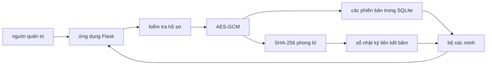

# dự thảo nội dung báo cáo

## trạng thái tài liệu

Tệp này giữ phần mô tả phương pháp và cài đặt đã có thể đối chiếu với mã nguồn. Các trường tác giả, tài liệu tham khảo, cấu hình máy, số liệu, bảng và kết luận định lượng phải được bổ sung từ tệp gốc và kết quả thực nghiệm thật.

Không đưa tệp này vào mẫu FAIR 2026 trước khi nhận lại mẫu báo cáo và kiểm tra quy định định dạng.

## tiêu đề đề xuất

Quản lý hồ sơ sinh viên có kiểm chứng bằng mã hóa xác thực và sổ nhật ký liên kết băm

## tóm tắt

Viết sau khi hoàn thành mục kết quả. Tóm tắt cần có bối cảnh, vấn đề, phương pháp, quy mô thực nghiệm, kết quả định lượng chính và giới hạn một nút. Không dùng các nhận xét như “chi phí chấp nhận được” nếu chưa có tiêu chí so sánh cụ thể.

## từ khóa

hồ sơ sinh viên, AES-GCM, tính toàn vẹn dữ liệu, kiểm toán, chuỗi liên kết băm

## I. mở đầu

Hồ sơ sinh viên chứa thông tin định danh, chương trình học và kết quả học tập. Việc chỉ giới hạn quyền truy cập cơ sở dữ liệu chưa đủ để phát hiện dữ liệu đã bị thay đổi ngoài quy trình của ứng dụng. Đề tài này khảo sát cách kết hợp mã hóa xác thực với một sổ nhật ký liên kết băm nhằm bảo vệ nội dung lưu trữ và tạo dấu vết kiểm toán cho từng phiên bản hồ sơ.

Hệ thống đề xuất chuẩn hóa hồ sơ thành JSON, mã hóa nội dung bằng AES-GCM với khóa 256 bit, lưu bản mã trong SQLite và tính SHA-256 trên toàn bộ phong bì mã hóa. Mỗi thao tác thêm, cập nhật hoặc xóa logic tạo một khối kiểm toán chứa giá trị băm của phiên bản và giá trị băm của khối trước.

Các đóng góp dự kiến gồm:

1. một luồng lưu trữ nguyên tử nối mã hóa, phiên bản dữ liệu và kiểm toán
2. cơ chế tìm mã sinh viên bằng HMAC mà không lưu mã ở dạng rõ
3. quy trình xác minh ba lớp cho liên kết khối, phong bì mã hóa và thẻ AES-GCM
4. bộ thực nghiệm có thể tái lập để đo chi phí của từng lớp bảo vệ

Các phát biểu trên cần được nối với tài liệu tham khảo phù hợp sau khi nhận lại danh mục nguồn gốc.

## II. nghiên cứu liên quan

Chia nội dung thành ba nhóm:

1. quản lý và bảo vệ hồ sơ giáo dục
2. mã hóa xác thực cho dữ liệu lưu trữ
3. chuỗi khối hoặc nhật ký chống sửa đổi trong giáo dục

### bảng so sánh cần hoàn thiện

| nghiên cứu | dữ liệu được mã hóa | cơ chế toàn vẹn | lưu lịch sử | thực nghiệm hiệu năng | giới hạn |
|---|---:|---:|---:|---:|---|
| nguồn 1 | chờ đối chiếu | chờ đối chiếu | chờ đối chiếu | chờ đối chiếu | chờ đối chiếu |
| nguồn 2 | chờ đối chiếu | chờ đối chiếu | chờ đối chiếu | chờ đối chiếu | chờ đối chiếu |

Không điền tên bài, năm hoặc kết luận từ trí nhớ. Mọi hàng phải được kiểm tra từ tài liệu gốc.

## III. hệ thống đề xuất

### kiến trúc



Hệ thống chạy trên một máy và có một đầu ghi. Vì vậy, thành phần kiểm toán được mô tả là sổ nhật ký riêng tư liên kết băm, không được coi là một mạng chuỗi khối phân tán có đồng thuận nhiều nút.

### dữ liệu lưu trữ

Ba bảng chính là:

* `records` lưu UUID nội bộ, chỉ mục HMAC, phiên bản hiện tại, trạng thái và thời gian
* `record_versions` lưu thuật toán, mã khóa, nonce, bản mã có thẻ xác thực, giá trị băm và thao tác
* `audit_blocks` lưu chiều cao, thời gian, liên kết khối, UUID, phiên bản, thao tác và các giá trị băm

Họ tên, mã sinh viên, ngày sinh, chương trình, học phần và điểm không được lưu dạng rõ.

### mô hình đe dọa

Đề tài xét kẻ sửa đổi có thể đọc và thay đổi tệp SQLite nhưng không biết khóa AES. Các hành vi thử nghiệm gồm sửa bản mã, sửa thẻ xác thực, sửa nonce, sửa giá trị băm, sửa liên kết và xóa một khối.

Mô hình không bao phủ kẻ có đồng thời toàn quyền cơ sở dữ liệu và khóa bí mật. Mô hình cũng không tự phát hiện việc thay cả tệp cơ sở dữ liệu bằng một bản sao cũ nếu không có đầu chuỗi tin cậy được giữ ở nơi khác.

### giao dịch nguyên tử

Khi tạo một phiên bản, hệ thống dùng `BEGIN IMMEDIATE` trước khi ghi. Việc ghi phiên bản, cập nhật con trỏ hồ sơ và nối khối nằm trong cùng một giao dịch. Nếu bất kỳ bước nào thất bại, SQLite hoàn tác toàn bộ thay đổi.

## IV. mô hình mật mã

### chuẩn hóa hồ sơ

Gọi hồ sơ chuẩn hóa là `R`. Dữ liệu rõ đưa vào mã hóa là:

```text
P = JSON_chuẩn(R)
```

JSON sử dụng UTF-8, sắp xếp khóa, không có khoảng trắng không cần thiết và từ chối giá trị không hữu hạn.

### mã hóa xác thực

Với mỗi phiên bản, hệ thống tạo nonce ngẫu nhiên 12 byte mới. Dữ liệu xác thực bổ sung liên kết bản mã với ngữ cảnh:

```text
A = JSON_chuẩn(record_id, version, operation, schema_version)
C = AES-GCM-Encrypt(K, nonce, P, A)
```

`C` gồm bản mã và thẻ xác thực 16 byte do thư viện `cryptography` trả về. Khóa `K` dài 32 byte và được đọc từ `.env`.

### giá trị băm phiên bản

Phong bì được băm gồm UUID, phiên bản, thao tác, phiên bản cấu trúc, tên thuật toán, mã khóa, nonce và bản mã:

```text
H_record = SHA-256(domain_record || JSON_chuẩn(phong_bì))
```

Tiền tố miền tách mục đích băm phong bì khỏi mục đích băm khối.

### giá trị băm khối

Khối thứ `i` chứa chiều cao, thời gian, UUID, phiên bản, thao tác, `H_record` và giá trị băm của khối trước:

```text
H_i = SHA-256(domain_block || JSON_chuẩn(block_i))
```

Khối đầu tiên có thời gian và dữ liệu cố định. Các khối sau phải có `previous_hash = H_(i-1)`.

### chỉ mục tìm kiếm

Khóa HMAC được dẫn xuất từ khóa AES bằng HKDF-SHA256 với chuỗi phân tách miền. Mã sinh viên chuẩn hóa được ánh xạ thành:

```text
lookup_token = HMAC-SHA-256(K_lookup, domain_lookup || student_code)
```

Cách này che mã sinh viên khỏi người chỉ đọc SQLite. Nó vẫn làm lộ việc hai giá trị tra cứu giống nhau và chưa hỗ trợ luân chuyển khóa độc lập trong phiên bản hiện tại.

## V. cài đặt

Ứng dụng dùng Python, Flask, SQLite và thư viện `cryptography`. Lớp `RecordService` là điểm điều phối duy nhất cho các thao tác hồ sơ. Giao diện không chứa câu lệnh SQLite hoặc thuật toán mật mã.

| nhóm mã | trách nhiệm |
|---|---|
| `src/domain` | chuẩn hóa và kiểm tra hồ sơ |
| `src/encryption` | JSON xác định, AAD và AES-GCM |
| `src/integrity` | HKDF, HMAC và SHA-256 |
| `src/database` | lược đồ, kết nối và truy cập dữ liệu |
| `src/blockchain` | cấu trúc và phép băm khối |
| `src/verification` | xác minh ba lớp |
| `src/services` | giao dịch nghiệp vụ thống nhất |
| `src/web` | giao diện quản lý và xác minh |

Phần này cần bổ sung ảnh thật của bảng điều khiển, danh sách hồ sơ, chi tiết hồ sơ, chuỗi khối và kết quả phát hiện thay đổi.

## VI. thiết lập thực nghiệm

### môi trường

| thuộc tính | giá trị |
|---|---|
| bộ xử lý | chờ ghi từ máy chạy đo |
| bộ nhớ | chờ ghi từ máy chạy đo |
| hệ điều hành | chờ ghi phiên bản chính xác |
| Python | chờ ghi phiên bản chính xác |
| Flask | lấy từ môi trường đo |
| cryptography | lấy từ môi trường đo |
| SQLite | lấy từ `sqlite3.sqlite_version` |

### dữ liệu và cấu hình

Dữ liệu mô phỏng gồm 100, 1.000 và 10.000 hồ sơ, sinh bằng cùng giá trị hạt giống. Mỗi quy mô được chạy 30 lần trên ba cấu hình:

1. chỉ SQLite
2. SQLite và AES-GCM
3. SQLite, AES-GCM và sổ nhật ký liên kết băm

Các chỉ số gồm thời gian thêm, thời gian đọc, thời gian xác minh, thời gian mã hóa, thời gian giải mã và dung lượng SQLite. Tệp thô được giữ nguyên trước khi tính trung bình, trung vị, nhỏ nhất, lớn nhất và độ lệch chuẩn.

Thử thay đổi trái phép chạy trên bản sao tạm của cơ sở dữ liệu. Mỗi trường hợp phải được lặp lại và báo cả số lần phát hiện lẫn tổng số lần thử.

## VII. kết quả và thảo luận

Chưa có số liệu. Chỉ điền mục này từ `experiments/results/raw_*.csv`, `summary_*.csv` và `tamper_summary_*.csv`.

### bảng thời gian dự kiến

| cấu hình | quy mô | thêm một hồ sơ | đọc một hồ sơ | xác minh toàn bộ |
|---|---:|---:|---:|---:|
| chỉ SQLite | 100 | chưa chạy | chưa chạy | chưa chạy |
| SQLite và AES-GCM | 100 | chưa chạy | chưa chạy | chưa chạy |
| cấu hình đầy đủ | 100 | chưa chạy | chưa chạy | chưa chạy |

Lặp lại các hàng cho 1.000 và 10.000 hồ sơ. Báo đơn vị rõ ràng, không trộn mili giây với giây.

### bảng phát hiện thay đổi dự kiến

| trường hợp | số lần thử | số lần phát hiện | tỷ lệ |
|---|---:|---:|---:|
| sửa bản mã | chưa chạy | chưa chạy | chưa chạy |
| sửa thẻ xác thực | chưa chạy | chưa chạy | chưa chạy |
| sửa nonce | chưa chạy | chưa chạy | chưa chạy |
| sửa băm phong bì | chưa chạy | chưa chạy | chưa chạy |
| sửa liên kết khối | chưa chạy | chưa chạy | chưa chạy |
| xóa khối | chưa chạy | chưa chạy | chưa chạy |

## VIII. nguy cơ ảnh hưởng tính hợp lệ

* dữ liệu mô phỏng có thể không phản ánh phân bố và kích thước hồ sơ thực tế
* phép đo trên một máy không đại diện cho mọi phần cứng
* SQLite và kiến trúc một nút giới hạn khả năng suy rộng sang hệ thống phân tán
* tác vụ nền và bộ nhớ đệm của hệ điều hành có thể ảnh hưởng thời gian
* ba cấu hình cần giữ cùng kiểu giao dịch và cùng cách truy vấn để so sánh công bằng
* chỉ mục HMAC và xóa logic có các đánh đổi riêng về riêng tư

## IX. hướng phát triển

* tách khóa tra cứu khỏi khóa mã hóa và xây dựng quy trình luân chuyển khóa
* ký số hoặc neo định kỳ giá trị đầu chuỗi ở vị trí độc lập
* thêm phân quyền theo vai trò và nhật ký đăng nhập
* thử nghiệm nhiều tiến trình ghi đồng thời
* đánh giá chính sách lưu giữ và xóa dữ liệu cá nhân
* nghiên cứu mô hình nhiều nút khi có yêu cầu phân tán thực sự

## X. kết luận

Viết sau khi có số liệu. Kết luận phải trả lời mục tiêu nghiên cứu bằng kết quả đo, nêu rõ lớp nào phát hiện loại thay đổi nào, chi phí bổ sung theo từng quy mô và giới hạn một nút.

## danh sách hình cần tạo

1. kiến trúc tổng thể
2. luồng thêm và cập nhật hồ sơ
3. luồng mã hóa và xác minh
4. lược đồ ba bảng SQLite
5. bảng điều khiển
6. danh sách và chi tiết hồ sơ
7. trang khối kiểm toán
8. trang xác minh khi dữ liệu bị thay đổi
9. thời gian thêm theo quy mô
10. thời gian đọc theo quy mô
11. thời gian xác minh theo quy mô
12. dung lượng theo quy mô

